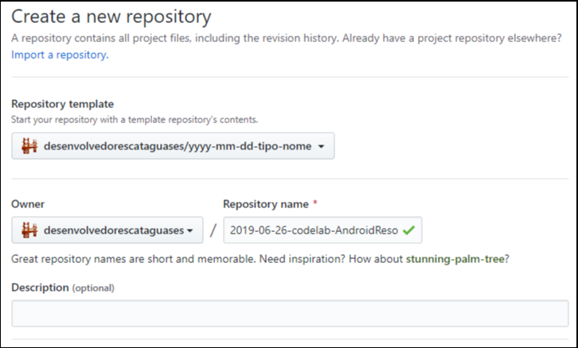

### Criando repositório da apresentação

#### Template
Ao criar novo repositório com padrão de nome conforme [adiante](#nome-do-repositório), deve selecionar o template do repositório, veja:

#### Nome do Repositório
Criar o repositório seguindo com nome `yyyy-mm-dd-type-name`, por exemplo `2019-06-26-codelab-AndroidResourcesLayouts` , sendo:

- **yyyy-mm-dd** = data que foi apresentada
- **type** = Tipo de apresentação (Talk, Codelab, ... )
- **name** = Nome da apresentação

##### Não se esqueça !
- Alterar **README.md** com informações da apresentação e palestrante(s);
- Colocar código fonte e documentos nas pastas correspondentes;

### Arquivos Markdown (.md)
o Markdown é uma formatação simples para arquivo de texto, com uma codificação mínima, além de fácil, ele é visualmente mais "limpo" No qual o GitHub utiliza para exibir os arquivos formatados desta forma.

Para saber como formatar arquivos como o README e outros:
- [Markdown Cheatsheet](https://github.com/adam-p/markdown-here/wiki/Markdown-Cheatsheet): Referência do próprio GitHub;
- [StackEdit](https://stackedit.io/app#): Um editor de Markdown online;
